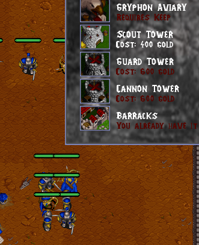
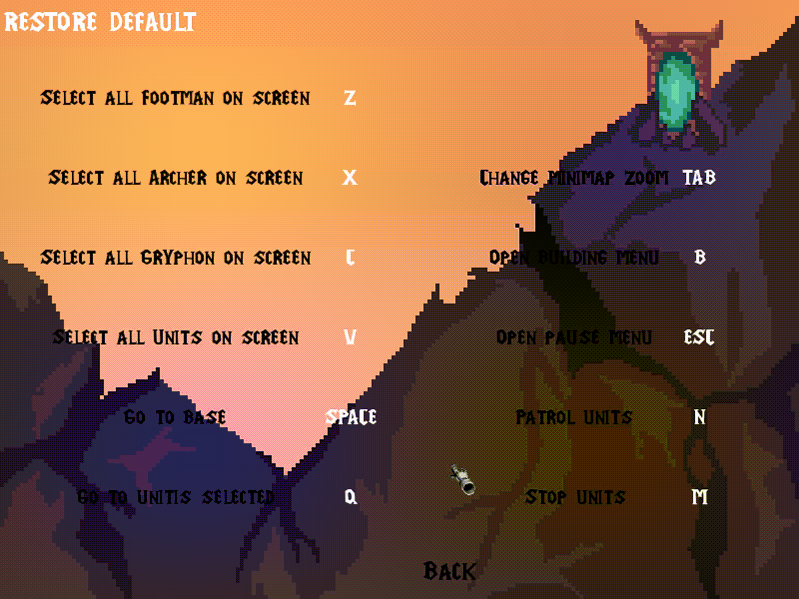
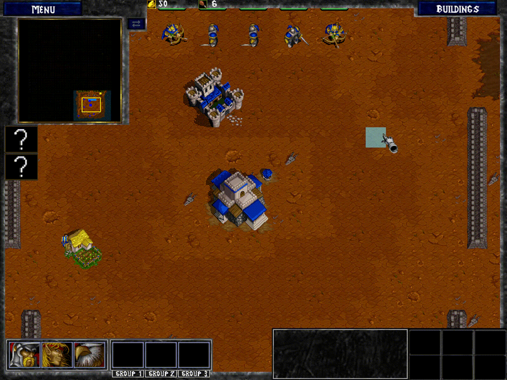
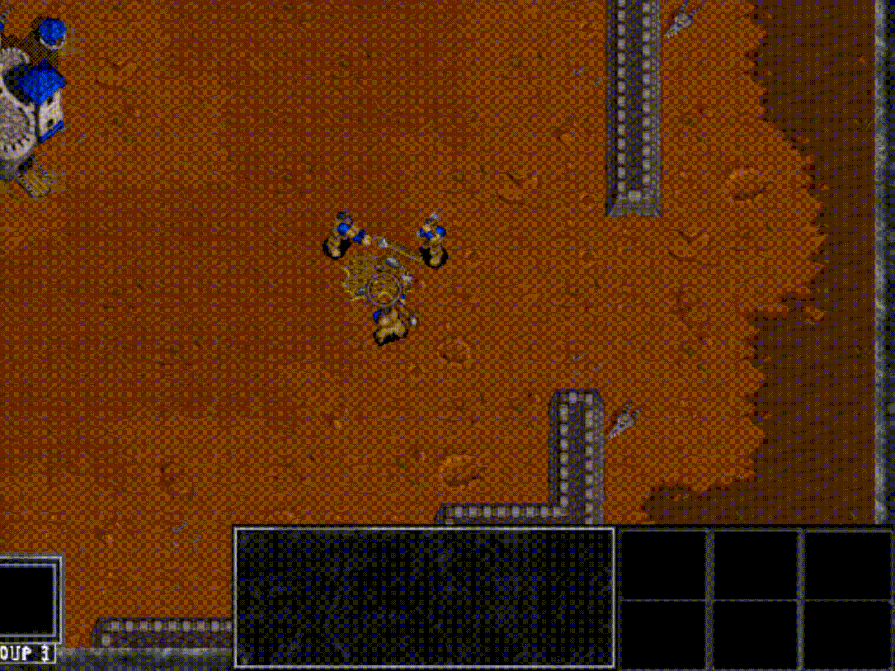
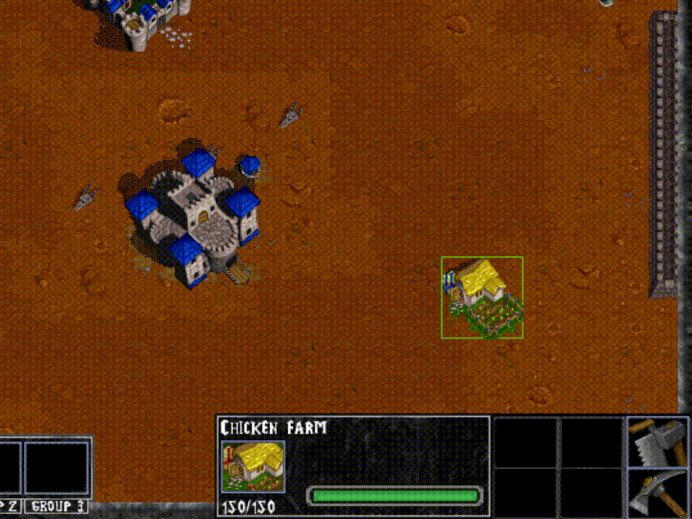
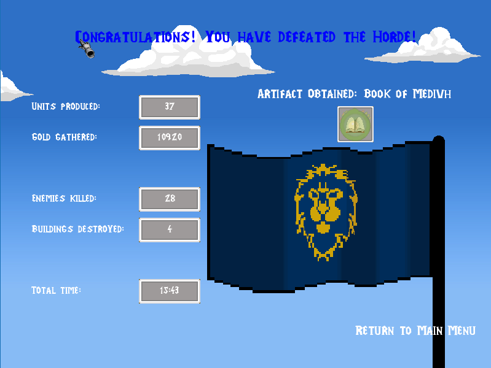

# Aleix Gabarró
## Individual Contribution

### Camera culling & Sprite ordering

Taking advantage of my personal research, I have improved the camera culling and the sprite ordering in order to adapt it to the general project.

The entities of sprite order arranges depending on the foot print position, and the UI is ordered depending on the type of each one, to avoid that some elements won’t be printed above interface.

In this picture, we can see the result of our sprite ordering

### Main menú

I have done all buttons functionality in the main menu, like the credits, that include personal website and the github of the group, the settings where we can change the audio volume and disable the fullscreen and also changing the controls which are going to be explained later, you can choose to run the last saved game with load game or start new game choosing one of the five maps that are available.

### Pause menu

Pause menu offers the same options than the main menu with the difference that instead of load the game you can save it. We can see an animation when opening the menu.

### Changing buttons

With the help of Aleix, this screen is in the settings of the menu pause and the main menu. It offers the player the ability to adapt the game to their preferences to make the experience more comfortable. Most keys can be changed, except camera movement, group selection, mouse controls and debug keys. These keys are blocked and the user can not use them for another function. In case one of the keys uses another one of those that can be exchanged, a swap is made. If you want to go back to the beginning keys you can do a restore defaults buttons. 
 

 
### Buildings menu

I've been in charge of the UI in the building menu, making changes of textures for the buttons and colors for the labels.

### UI in game of the buildings

I have made the UI in game of the buildings, where there are increasing lifebars while being built, and when they finish, they create the specific buttons for each building, where there is always a button to repair the building and in most of them one to destroy it.

There is also the destruction function of the building where we can observe the loss of life on screen, fire implementations depending on their life and repair, along with the cost that depends on the lost life and the size of the building.

### Final screen
It is the entire module at the end of the game, where all the UI is found, and data the from the game. In case of winning, there is an artifact that is added to the collection, and there are 4 independent artifacts of each level which must be achieved at every difficulty available in the game

### Save&Load
I have included a Save/Load functionality to the game with the help of Oscar. We save the current state of the game so the player can resume the game later at the point he saved the game.

## Wiki Contribution

All UI document
