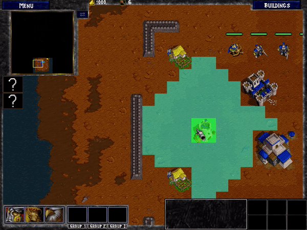
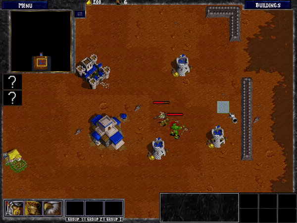
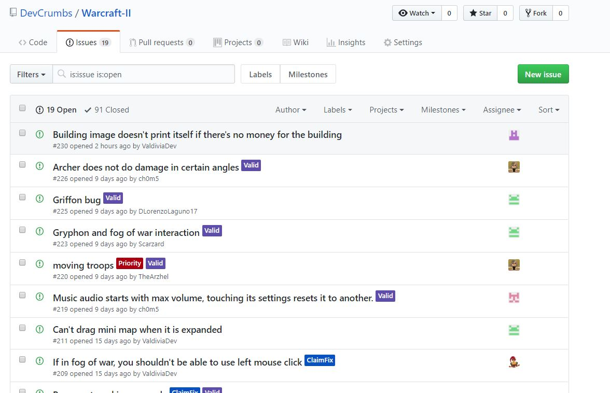
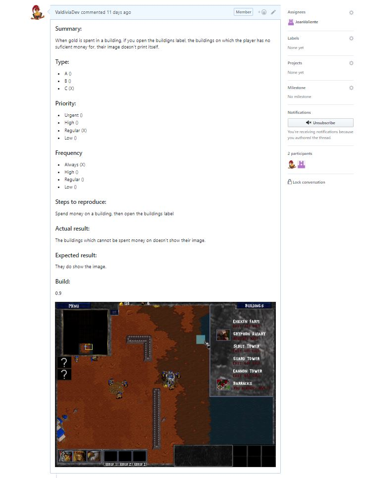
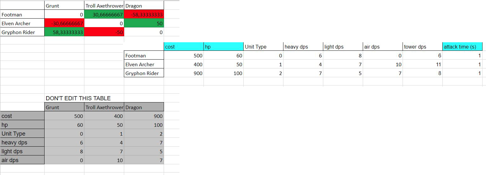
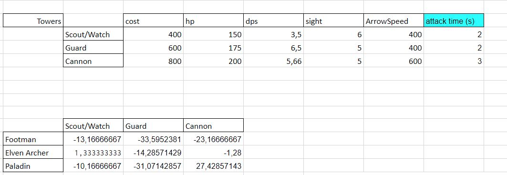
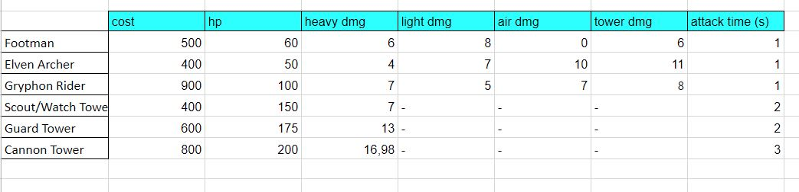

# David Valdivia
## Individual Contribution

## Wiki contribution

- Quality Assurance document
- Some of the Game Design Document
- Market analysis
- General wiki orthographic and grammatical revision

## Logic for the building placing and construction

I made the logic for the placing and construction of the player’s buildings.
Firstly, the logic for where the player can or cannot place a building in base, depending if there’s a unit in place, another building or an unwalkable tile. Depending on what it is is beneath the building on each case, a green tile will be print on the tiles of the building that indicate a tile in which the building can be placed, and a red tile on where the building cannot be placed, in the phase where the player decides where to place the building.
When the player finally decides where to place the building, a building process of ten seconds will be initiated on which a construction process for the building will be shown.

The range of the tower’s attack is also indicated on the preview building process

## Logic for the tower’s attack

The logic for the towers consists in two processes:
- The identification of the entities which the tower has to attack
- The process of attacking these entities

The first process consists on identifying the dynamic entities that enter on sight of the tower’s range and discriminating those that aren’t of a different faction from theirs, in other words, human towers will attack orcs, and orc towers will attack humans. After that process is done, the tower internally, will keep a list of the enemy entities on their range and will manage which entities it kills and get out of its range, to remove them from the list.
On the process of attacking an entity, the tower will attack only one entity; the one that has been a longer time on its range. When attacking an entity, the tower will  send an arrow or a cannon ball (depending on the tower type) on the enemy direction, that will damage it. This was firstly done looking the position of the enemy entity regarding the tower position, but was later changed to be managed with the destination assigned to the arrow or cannon ball particle.

There are three types of towers for each of the two factions. The watch (enemy tower) or scout towers (player tower), the guard towers or the cannon towers.
 

## Audio implementation and choosing

I implemented the whole music and sound effects of the game into the code, to sound whenever it is necessary. All the musical repertory and most of the sound effects and voices are directly ripped from Warcraft II. The rest of the sound effects have been carefully chosen from other Blizzard™ games; those being World of Warcraft and Hearthstone. They were selected from two games from the Warcraft universe, to ensure that they fitted the tone of the game.

I also made a really small system for the unit selection and unit command voices not to sound all at the same time and for the game to select the appropriate sound to play regarding the number of each unit type on the selected unit group. In other words, the voice of the unit that sounds when selecting or commanding a unit group will be the one of the unit type with more members in that group. If there are the same number of members for each type of unit, the sound of the unit type to sound will be selected randomly. I also made it for the music of the level to be selected randomly, (out of the four songs that there are) and for the unit voice of each type of unit and action that can be performed by that unit, to be selected randomly too (every ally unit except for the gryphon rider has four or five different sounds for performing the same action).

All the sounds or music that needed to be edited to sound at less or more decibels, or to be shortened have been edited in Audacity®.

 
## QA Testing

As the one in charge for quality assurance in the team, the job that I have done the most during all the course of the game has been to intensely test the game to found all the bugs and other programming errors that I could found over the development of the game.

What I used for the bug notifying, has been primarily github issues, to keep all the team informed of the bugs that the game has had in each moment, their priority and who should fix them.

*Issue hub*

*Issue example*

Additionally, another method I used on some sprints where the team had implemented a lot of functionality into the game, has been Bug Reports that had a .txt document where I ordered each bug regarding if it was a visual bug, gameplay bug or game breaking bug. Alongside with the.txt, I included photos of each bug, and in the case of the game breaking bugs, the place in the code where the game broke. By doing this, I ensured that all of the members of the team were aware of all the bugs that had surged on that specific sprint and for them to have it handy when they were going to fix them.

## Video game balancing

I helped to the balance of the game by ensuring the unit triangle was as consistent as possible. What I mean with that is that the three unit types in the game were balanced enough to make the three of them equally useful. The way I made it was with a formula that calculates the resulting gain or loss of the cost for the player when two different units confront each other.

For balancing the different values of HP, attack and unit cost I used a google spreadsheet to determine how every unit would do against another unit depending on these values. The player’s units and the enemy units are are the counterpart to one another; in other words, they have the same attributes, even though they have different names.

*Payoff table and unit's attributes*

To balance the tower’s attack towards the units I used a similar method, but taking into account that the towers take a longer time to attack compared to units.

*Payoff tower for the towers and their attributes*

With all the information gathered from the cost payoff tables I could determine the final values for every unit and tower.

*Final attributes of every unit and tower*

For more information on how I balanced the units, you can check a research project I made on RTS balancing, [here](https://valdiviadev.github.io/RTS-balancing-research/).

## Other various tasks

- Arranged the buildings and some of the units’ spritesheets and charged the building and unit animation coordinates to the code
- Made initial implementation for the unit spawn queue in the barracks
- Remade part of the particle module
- Implemented the way that gold mines give you gold and how that is shown to the player
- Made menus for the selected prisoners and neutral buildings
