# Joan Valiente

## Individual Contribution

### Design

- **Documentation:** One of my task as a game designer is to document as specifically as posible everything. These documents are of game pilars, GDD, features, balancing, first ideas, UI, etc.

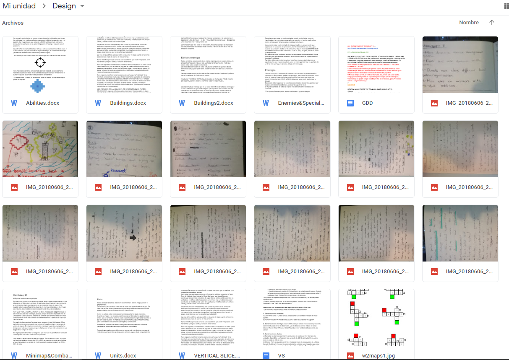

- **Level Design and maps**: Another task is the level and map designs. Working with Tiled, and lots of sketches, I've done all the maps working in the different "zones" separately and then joining them.

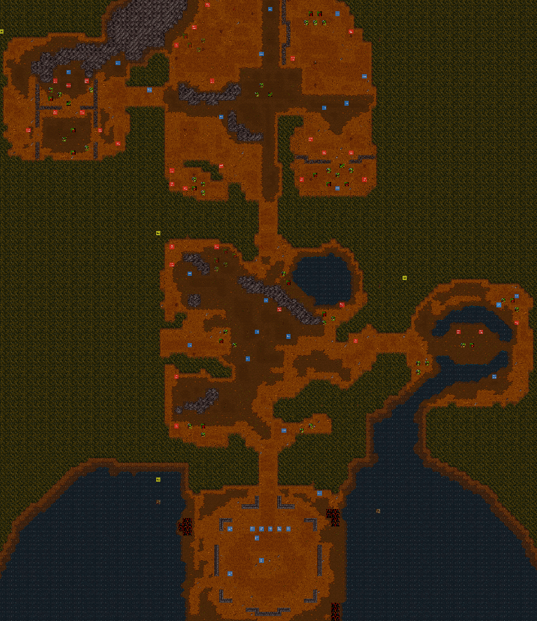

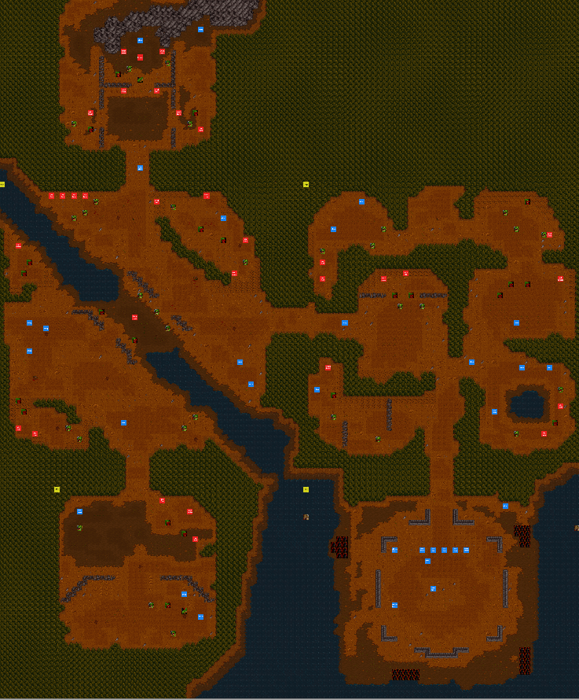

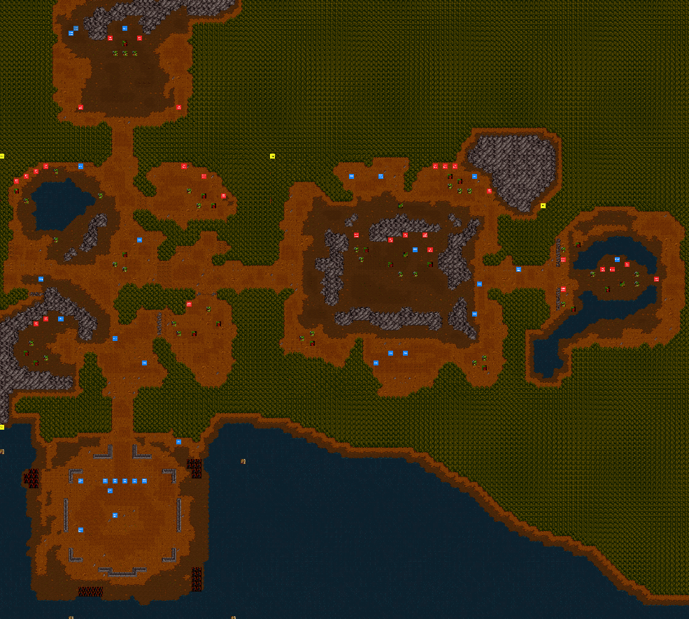

- **Balancing**: Balancing is a really important part and it took lots of hours and iterations. I've worked with David Valdivia on the balance of the game, in order to make a funny and fair gameplay.

- **UI**: As a designer, I've also worked in the UI design. What information should be shown to the player, where should it be displayed and in what circumstances, etc.

### Code

- **UI:** I've colaborated with my teammates with the UI logic. Units selection information, building menu, groups selection, King Terenas dialogs, advice messages, etc; have been some of my task on the programming of the UI.

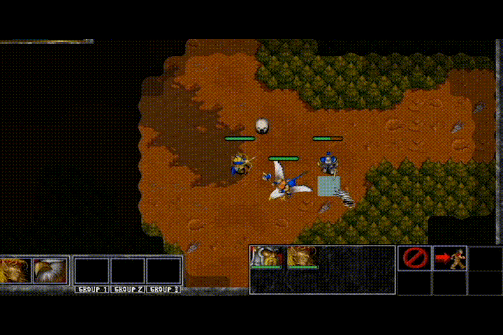

(Units selection panel)

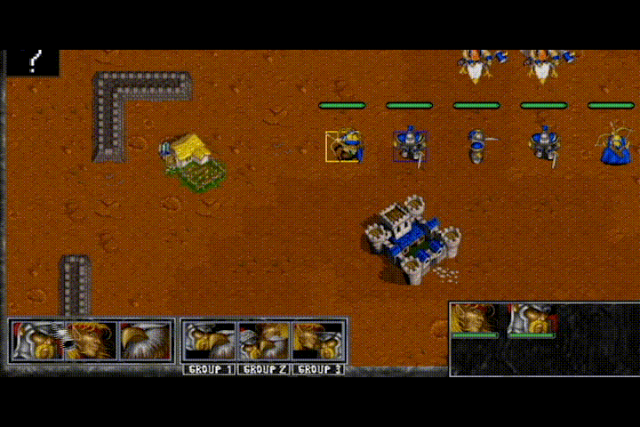

(Groups buttons)

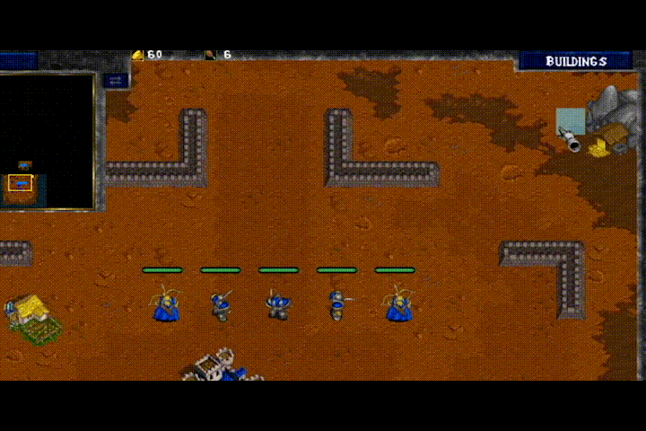

(Building menu)

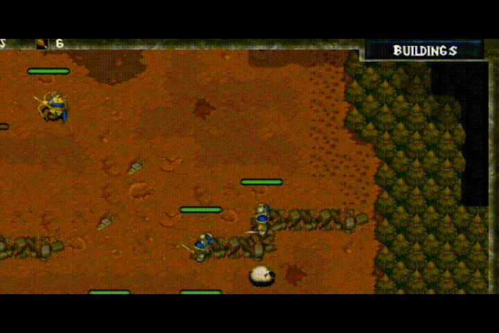

(King Terenas Dialog)

- **Ships:** Ships of the Horde that brings the enemies to the player's base. There are 4 different directions by which they can come.

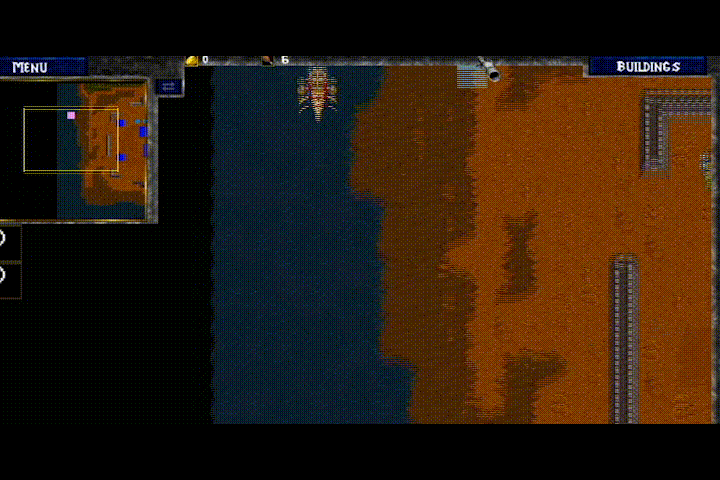

- **Video Player:** I've implemented a video player module to reproduce the intro of the team.

### Art

- I've also worked on the art of the game UI elements. Things like frames for the buttons, different sprites for their state, background menus, enemies and allies life bars, etc. Here are some examples.

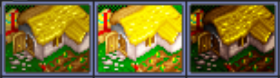

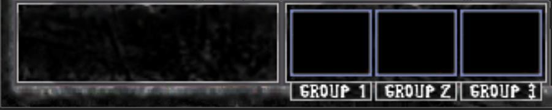

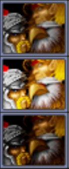

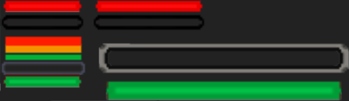

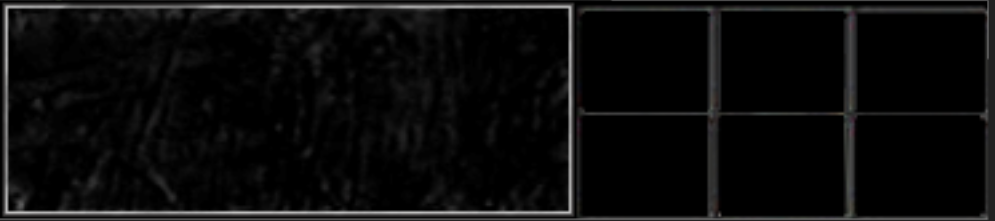

- **Criters paws sprites**.

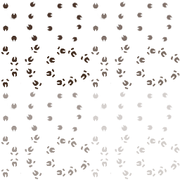

### Other tasks:
- Gold management logic.
- QA Test.
- Building upgrades.
- Bug fixing.
- Minimap button.

### Wiki tasks:
- GDD (with Sandra Alvarez).
- Warcraft universe lore study. 
