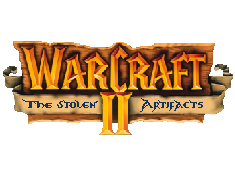

# Manav Lakhwani
## Individual Contribution

## Art
**Main Menu:**

- Title:

- Orbs surrounding the artifacts:

    

**Pause Menu:**

- Parchment:

- Sliders and UI elements:

**End Screens:**

- Background, flag, logo, and UI boxes art:

**In game:**

- UI:

King Terenas, Frame, Click Animations.

  

- Sprites:

All the main sprites and icons were taken from the orginal Warcraft II, althought some modifications were needed.

*Turalyon was created from start:*

 

*Building animation for visual feedback:*

 

- Particles:

Create Life Regeneration sprites, blue fire for the gryphon and imporvements in the cross.

## Wiki Contribution
- Audio Bible
- Production Plan

## Other Tasks

- Make the Trailer of the game.
- Make the Gameplay of the game. 
- Follow and complete this <a href="https://docs.google.com/spreadsheets/d/14-UIJO-KuzA6y5WvJ3r7p0voYYX6MbsT9fxRBz3a6zE/edit?usp=sharing">spreadsheet</a>.
- Find and download the majority of the audio files and sprites belonging to Blizzard Entertainment.
