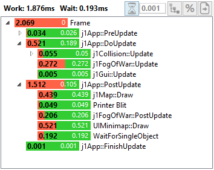
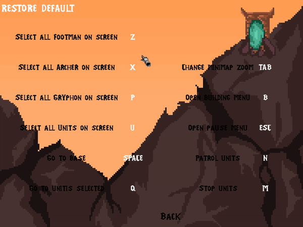

# Óscar Hernández
## Individual Contribution

- **Random map:**  
I have developed a module to generate a semi-randomly generated maps. This module can generate this maps using xml files. It uses one file as a general map structure, to decide the shape of the map. Then the module decides which room to load from the given pool in the structure file. 

 
	_Random map code_  	

 
	_Random map example_  	
  
- **Pathfinding:** 
In order to adapt the A* algorithms to the rooms-based map I improved the pathmanager module. The module launch a high-level pathfinding (using the general map structure from the random map generator), deciding which rooms the unit will need to go through. Once the next room the unit has to go is decided, a low-level path is launched to from the unit’s current location to the next room entrance. This process is repeated until the unit gets to the desired location.

 
	_Pathfinding_  	

- **Read map logic from xml:** 
We have used Tiled to create the maps, the logic of the maps are also saved in the xml files. 
I have developed functions and methods to read the map logic, ally and enemy entities spawns, buildings and rooms.
The enemy dynamic entities are loaded in groups.

 
	_Map logic code_  	

- **Fog of War:** 
I included the fog of war to the game. The FoW has 3 levels, unit sight, explored, unexplored.

 
	_Fog of War_  	
	
- **Map / fow  drawing optimization:** 
One of the biggest problems we encountered was the performance. I have worked on the optimization of the map and the FoW. Using the optimization process the map draw function consumes 0.4ms, 25ms less.
The FoW uses arround 0.5ms with the optimization and 168.3ms without.

 
	_Frame time without optimization_  	
	
 
	_Frame time with optimization_  	
	
- **Minimap:** 
I have implemented my minimap project to the game.  Various extra features like a zoom toggle, moving the camera from the minimap and sending the selected units to a point selected on the minimap.

 
	_Minimap_  	
	
- **Enemy wave:** 
I have worked on the Enemy Wave module, creating the functions to decide how many enemies will appear in the wave.

- **Smooth camera movement:** 
I have improved the camera movement, making the speed of the camera inversely proportional to the distance of the mouse to the border of the screen.

 
	_Camera movement_  	
	
- **Save and load:** 
I have included a Save/Load functionality to the game with the help of Aleix. We save the current state of the game so the player can resume the game later at the point he saved the game.

 
	_Save and load_  	
	
- **Keys redefinition:** 
With the help of Aleix, I have developed a system so the player can change the controls of the game and restore the default controls.

 
	_Keys redefinition_  	
### Wiki tasks:
- TDD (with Sandra Alvarez).
