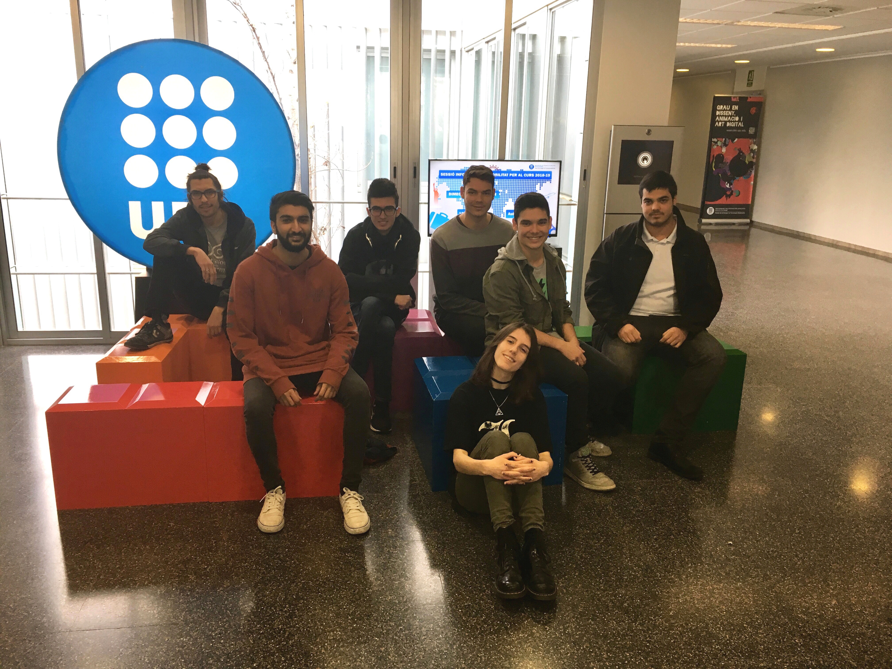

# Warcraft II: The Stolen Artifacts

Warcraft II: The Stolen Artifacts is an expansion that derives from the videogame Warcraft II: Tides of Darkness. 
The game is set after the events of Tides of Darkness, in which a small group of the Azeroth's army must expedition to a now destroyed Draenor to find the legendary alliance expeditioners that became trapped in Draenor, and defeat the evil Ner’zhul, 
by retrieving one of the four artifacts he stole from Azeroth.

The player must command this expedition in an RTS dungeon crawler game in which they must recover the stolen artifacts by rescuing the lost expeditioners Alleria and Turalyon.

# The team: DevCrumbs

DevCrumbs is an independent video game company based in Terrassa, Catalonia. Born from a university project, it is formed by a 
group of students from the second year of the Bachelor's degree in Video Game Design and Development (UPC). 
Although each member of the team has been involved in similar projects before, we are currently working on our first game together. 
The overall aim of the company is to create enjoyable gaming experiences, a unique kind of work that we are passionate about. 
If we are able to feed your imagination, our mission will be accomplished!

In order to cover all the areas needed to fulfill the project, each of us has a different responsability in the team. 
Despite that, we all have worked in those areas which request more dedication and helping each other to achieve the best results on time. 

Down here you can find the GitHub page for each one of the team memebers and the individual contribution each one of us has done in the team.

**Lead**: Sandra Alvarez
* [GitHub account](https://github.com/Sandruski)
* [Individual contribution](https://devcrumbs.github.io/Warcraft-II/Sandra_Alvarez)  

**UI**: Aleix Gabarró
* [GitHub account](https://github.com/aleixgab)
* [Individual contribution](https://devcrumbs.github.io/Warcraft-II/Aleix_Gabarro)  

**QA**: David Valdivia
* [GitHub account](https://github.com/ValdiviaDev)
* [Individual contribution](https://devcrumbs.github.io/Warcraft-II/David_Valdivia)  

**Art/Audio**: David Varela
* [GitHub account](https://github.com/lFreecss)
* [Individual contribution](https://devcrumbs.github.io/Warcraft-II/David_Varela)  

**Code**: Óscar Hernández
* [GitHub account](https://github.com/OscarHernandezG)
* [Individual contribution](https://devcrumbs.github.io/Warcraft-II/Oscar_Hernandez)  

**Management**: Manav Lakhwani
* [GitHub account](https://github.com/manavld)
* [Individual contribution](https://devcrumbs.github.io/Warcraft-II/Manav_Lakhwani)  

**Design**: Joan Valiente
* [GitHub account](https://github.com/JoanValiente)
* [Individual contribution](https://devcrumbs.github.io/Warcraft-II/Joan_Valiente)  

# Where can you find us

* **Social Networks**:

 [Twitter](https://twitter.com/DevCrumbsGames)
 
 [Instagram](https://www.instagram.com/devcrumbsgames/)
 
 [Facebook](https://es-la.facebook.com/DevCrumbsGames/)

* **GitHub repository**: 

[GitHub repository](https://github.com/DevCrumbs/Warcraft-II)
* **Wiki**: 

[DevCrumbs wiki homepage](https://github.com/DevCrumbs/Warcraft-II/wiki)

# Release

# Trailer

You can visualize a trailer for the game here.

<iframe width="560" height="315" src="https://www.youtube.com/embed/wkLv1oAxmuI" frameborder="0" allowfullscreen></iframe>

# Gameplay video

## Controls

   - Space: Go to player base
   - Up arrow or W: Move the camera up
   - Down arrow or S: Move the camera down
   - Left arrow or A: Move the camera left
   - Right arrow or D: Move the camera right
  
   - Z: Select all Footman on screen (max 8 units)
   - X: Select all Elven Archer on screen (max 8 units)
   - C: Select all Gryphon Rider on screen (max 8 units)
   - V: Select all units on screen (max 8 units)
  
   - Q: Move the camera to the units selected
  
   - Left/Right Ctrl + 1/2/3: Save a group of units to a slot
   - Left/Right Shift + 1/2/3: Select a saved group of units from a slot
  
